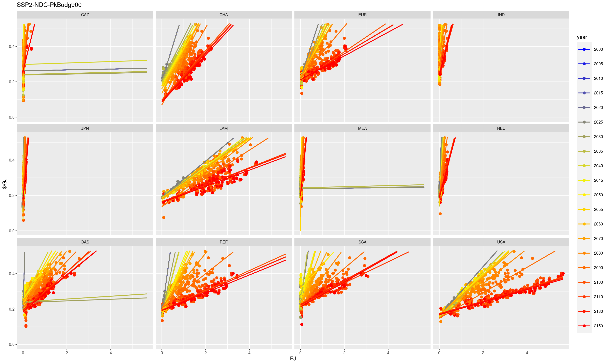
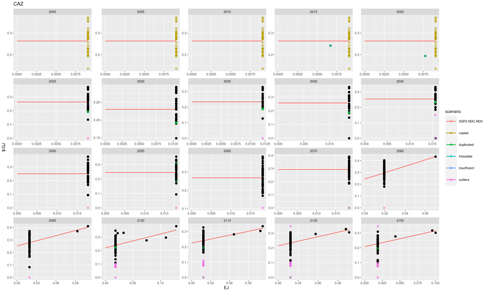

# Introduction

In many REMIND mitigation scenarios bioenergy plays a major role in decarbonizing the energy system (e.g. [Klein et al. 2013](http://link.springer.com/article/10.1007%2Fs10584-013-0940-z)). Thus, the biomass potential and its costs are crucial factors that affect overall mitigation costs ([Klein et al. 2013](http://link.springer.com/article/10.1007%2Fs10584-013-0940-z), [Rose et al. 2013](http://link.springer.com/article/10.1007%2Fs10584-013-0965-3)). In REMIND there are two types of biomass, **residues** and **purpose-grown biomass**. Residues are available at a constant price of 1 $/GJ and have a (linearly increasing) maximal global potential of less than 55 EJ/yr. The resource of the more relevant purpose-grown biomass has no explicit upper limit. Its potential and supply price are represented by **regional biomass supply curves** that provide the bioenergy **price as a function of bioenergy demand** ([Klein et al. 2014](http://iopscience.iop.org/1748-9326/9/7/074017)). REMIND calculates the costs by integrating the price function. **This tutorial describes how to derive these bioenergy supply curves** from the global landuse model MAgPIE. 

Since the supply curves reflect MAgPIE's price response to the demand for bioenergy they are called the **MAgPIE emulator**. Actually, the MAgPIE emulator comprises further MAgPIE data in REMIND representing the landuse system, especially landuse emissions from agriculture and bioenergy production, and agricultural production costs. In contrast to the bioenergy supply curves, which are part of the optimization in REMIND, these further MAgPIE data are given by fixed exogenous trajectories available for a couple of SSP-RCP combinations. A description can be found [here](https://redmine.pik-potsdam.de/projects/remind-r/wiki/Updating_inputs_from_MAgPIE). This tutorial focuses on the biomass supply curves only.

By default REMIND uses the aforementioned data (bioenergy price and emissions) that was originally derived form MAgPIE. In most cases and if not explicitly requested, REMIND runs uncoupled to MAgPIE (**standalone mode**). Therefore there is no feedback from the MAgPIE model to the bioenergy demand and carbon price from REMIND. However, bioenergy prices in MAgPIE are sensitive to the carbon price (Klein et al. 2014). Also, SSP assumptions affect bioenergy prices (e.g. a SSP1 scenario tends to show lower bioenergy prices than a SSP5 scenario). Thus, it would not be appropriate to use a single supply curve in REMIND for different RCPs and SSPs. For this reason, there are different supply curves implemented in REMIND (derived from MAgPIE applying different carbon prices and SSPs), one of which can be chosen according to the the actual SSP-RCP scenario.

To reach a higher consistency between REMIND and MAgPIE regarding bioenergy prices (and landuse emissions), REMIND can also be run in **coupled mode** iteratively with MAgPIE. In this case MAgPIE runs subsequently to REMIND using the bioenergy demand (and the carbon price) to calculate actual bioenergy prices (and landuse emissions). In the next iteration REMIND uses this price response to update its supply curves by scaling them upwards or downwards (multiplicative adjustment). The iteration is repeated until the bioenergy market is in equilibrium, i.e. until demand and price do not change across iterations. Note that **in both cases (stand-alone and coupled) REMIND uses the bioenergy supply curves, which are updated by MAgPIE only in the latter case.**

If developments in the MAgPIE model affect bioenergy prices (e.g. by integrating afforestation or by modifying crucial input data such as food demand) it is necessary to derive new bioenergy supply curves (as described below) in order to (i) reflect these changes in REMIND standalone runs or (ii) to provide a better starting point for the convergence in coupled runs.

## The method

The bioenergy supply price curves are derived by measuring the price response of the MAgPIE model to 73 different global bioenergy demand scenarios. Each global bioenergy demand scenario yields a time path of bioenergy production and bioenergy prices for all MAgPIE regions. For each region and time step the supply curve is fitted to the resulting 73 combinations of bioenergy production and bioenergy prices.


## Main steps

* Optional: Prepare input data for MAgPIE (MATLAB on your computer): 73 bioenergy demand scenarios, GHG price scenarios (e.g. No tax, tax 30, ...). This step can be skipped for bioenergy demand if you want to use the standard set of input data that is automatically downloaded by the emulator script mentioned below.
* Start MAgPIE runs on the cluster using the emulator start script that is shipped with MAgPIE. For each GHG price scenario 73 MAgPIE runs with different bioenergy demands are started.
* Calculate the supply curves using the emulator function of this R package.
* Feed the resulting files into [mrremind](https://github.com/pik-piam/mrremind) to make it part of the REMIND intput data.

These steps are explained in detail below.

# 1. Perform MAgPIE runs
## 1.1 Start emulator runs

* Clone MAgPIE on the cluster
  * `git clone https://github.com/magpiemodel/magpie`
  * Checkout the appropriate branch (most likely the develop branch, sometimes the rc (=release candidate))
* In `config/scenario_config_emulator.csv` characterize the scenarios and set `start` to `1` for those you want to get supplycurves for (e.g. SSP2). Each line in `config/scenario_config_emulator.csv` defines one **scenario**. For each scenario the start script (see below) will launch 73 MAgPIE runs applying 73 different bioenergy demand trajectories. The characteristics of a scenario are defined in the columns of `config/scenario_config_emulator.csv`, most importantly the MAgPIE basic configuration (`mag_scen`) and the RCP represented by a carbon price trajectory (`co2tax_2025`). In detail:
  + `title`: can be neglected, the name of the output folders will be generated automatically based on the scenario settings
  + `start`: defines if this scenario will be run (1) or not (0)
  + `mag_scen`: a combination of built-in pre-defined scenario settings available in MAgPIE, such as SSP, NDC, ...
  + `co2tax_name`: the name that will be used to name the output
  + `co2tax_2025`: the name of a REMIND mif file containing the GHG prices that will be applied for this scenario. **IMPORTANT: You need to copy the mif files to the MAgPIE main folder before starting the MAgPIE runs!**. E.g. a file like `REMIND_generic_C_SSP5-NDC-rem-5.mif`.
* Start emulator runs using `Rscript start.R` -> `9: extra` -> `2: emulator` in the MAgPIE's mainfolder


## 1.2 Calculate bioenergy supply curves

The supply curves are generated automatically by one of the output scripts available in MAgPIE. It is located here `scripts/output/extra/emulator.R` and uses the `emulator` function of this package. For more details  please see the `vigentte("remulator")` and `?emulator`.

* After all 73 MAgPIE runs belonging to a scenario are fished the emulator should already be available for this scenario, since the last of the 73 runs triggers the emulator script for the respective scenario.
* The emulator script creates a new folder `output/emulator`, containing individual subfolders for each scenario from the scenario_config file.
* The supply curves are linear fits through the 73 points in the biomass price / quantity sphere for each time step and each region. The fits are represented by coefficients $a$ (y-intercept) and $b$ (slope).
* Within the scenario folders the fit coefficients are stored in a file (that will go into REMIND) like `f30_bioen_price_SSP2-26_690d3718e151be1b450b394c1064b1c5.cs4r` and visualized like in `scatter-fit-allyears-fixed-SSP2-NDC-PkBudg900.png`:

{width=100%}

* If no supply curves are available, you can start the emulator script manually using 
  * `Rscript output.R`.
  * -> select the number of only **ONE** of any of the runs that belong to the scenario you want to produce the emulators for. The other runs belonging to this scenario will be identified automatically.
  * -> `6: extra` -> `4: emulator`
* In case you need to debug find the underlying script here `scripts/output/extra/emulator.R`

## 1.3 Correct emulators if necessary (replace flat fits)

You will probably note that for some regions (usually regions with low biomass potential, often CAZ or MEA) the algorithm was not able to find a good linear fit in every time step. This often happens when the slope of the fit would need to be infinite (or at least very high), i.e. when there is no biomass potential, irrespective of the price that is being paid. In this case, the fit is (often) a flat line with slope zero, or close to zero (e.g. `scatter-fit-SDP-NDC-NDC-CAZ.png`):

{width=100%}

For **each scenario** these **flat fits** need to be **adjusted manually**, so that they are either overwritten by values from subsequent years (for example using 2055 values also for 2050), or simply removed (i.e. that there is no potential at all in the respective year for the respective region). This is done with the `replace_flat_fits.R` script (which is part of this package):

* Check for each region, in which time steps the fit functions are too small and set respective coefficients to `0.01` (just needs to be a small enough number $0 < x \leq 0.01$). Given a region, for all of these time steps the algorithm will now automatically use fits from subsequent years.
* If there are no “good years” at all (happens quite often for MEA for example), it might be necessary to set coefficients to `NA` manually (but in most cases, this is not necessary or it was already done automatically). This will result in emulators that don’t allow for any bioenergy production in the respective region.
*	Attention: in the .png files for each region (e.g. `scatter-fit-… -CAZ.png`) it is sometimes difficult to see if slopes are really too small, since the scaling of the x- and y-axes are not fixed, so better double check with the plot for the respective year (e.g. `scatter-fit-…-y2045.png`), here the scaling is fixed and the slope can be compared with other regions.
*	After setting coefficients for all respective regions and all time steps to `0.01` or `NA`, run replace_flat_fits.R.  The script will create a new subfolder “replaced_flat”, where now all fits should be corrected (you can check the new `scatter-fit-allyears-fixed-….png` if all flat fits were replaced).
* use the code example from below to replace the flat fits. Place the code into a script in the `output/emulator` folder adapt it to your needs and run it via `Rscript`.

```
# ---- SSP2 Budg600 ----

# For the Budg600 there is a bad (but not flat) fit for IND in 2050. 
# To replace this bad fit for 2050 we set the fitcoeffcient in IND in 2050 to <0.01,
# which causes the replace_falt_fits function to replace it with the 2050 fit

load("SSP2-NDC-Budg600/linear/data_postfit_SSP2-NDC-Budg600.Rdata")

fitcoef["IND","y2050",] <- 0.01

save(fitcoef,data,filtered,userfun,file = "SSP2-NDC-Budg600/linear/data_postfit_SSP2-NDC-Budg600-IND-prepared.Rdata")

replace_flat_fits("SSP2-NDC-Budg600/linear/data_postfit_SSP2-NDC-Budg600-IND-prepared.Rdata",emu_path = ".")


```

* The `replace_flat_fits.R` script does not copy the regional code of the original file (`f30_bioen_price_....cs4r`) with the fit coefficients. Therefore, rename the new file (in the `replaced_flat` folder) by copying the region code (e.g. `_690d3718e151be1b450b394c1064b1c5` or the new shorter one) to the end of the filename. E.g.:
*	`f30_bioen_price_SDP-NDC-PkBudg900_replaced_flat.cs4r` -> `f30_bioen_price_SDP-NDC-PkBudg900_replaced_flat_690d3718e151be1b450b394c1064b1c5.cs4r`
*	This needs to be done for every scenario, where flat fits were replaced


# 2. Add to REMIND input data via MRREMIND
* copy the files produced by the emulator script (see 1.2) or by the replace-script (see 1.3) into "sources/MAgPIE" of your input data preparation folder
* add these files to list of files in `readMAgPIE.R` and if necessary add the new scenario names to the renaming list in `calcBiomassPrice.R`
* run `calcOutput("BiomassPrices", round=6, file="f30_bioen_price.cs4r", realization="magpie_40")`
* this produces the file `output/default/f30_bioen_price.cs4r`
